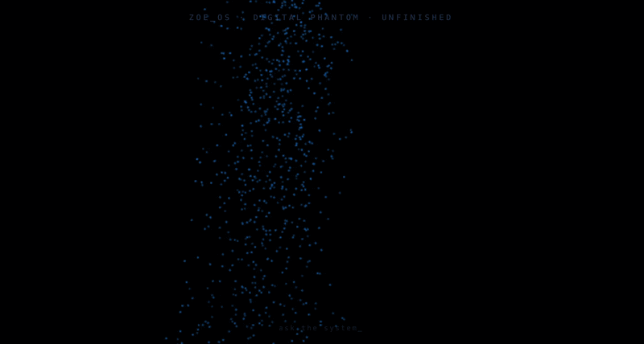

# Zoe OS · Digital Phantom — Build Log & Unfinished Attempt

> One full day. Four AIs. This is what we got. Not what was imagined.

## What I was trying to build

A black space. No UI chrome. No landing page.

Particles drift in from the void, slowly converge, and condense into a human silhouette — Zoe.
She breathes. Particles flow. She is ambient, present, slightly cold.
One input at the bottom: `speak to Zoe`.
When you type, the particle field reacts — turbulence on sharp questions, stillness on silence.
She is connected to an LLM with a real personality: trilingual, direct, INTP, Scanner-type, Hainan/Fukuoka perspective.

Think: *Ghost in the Shell* title sequence energy — but interactive and personal.

## What actually happened

One full day. Four AIs. Multiple attempts. Honest record:

| AI | Role | Result |
|----|------|--------|
| **GPT-4V** | Initial concept exploration | Good at describing the vision. Poor at translating it to Three.js geometry math. |
| **Gemini** | Generated a reference image of the target aesthetic | The image looked right. The code did not match the image. |
| **DeepSeek v4** | Body shaping math, Bloom post-processing | Got closest. Recognizable female silhouette. Camera frustum issues remained. |
| **Claude** | Debug partner, file rewrites | Fast at fixing errors. Same fundamental bottleneck. |

The core problem nobody solved: describing a *visual feeling* to an AI and getting back correct Three.js camera + particle math that actually produces that feeling.

## Current state

`src/components/Zoe/ZoeScene.tsx` contains:

- 50,000 particles across a body-shaped skeleton
- Simplex noise for organic breathing movement
- Additive blending for the glow effect
- Bloom post-processing via `@react-three/postprocessing`
- Gemini API with a real system prompt (Zoe's actual personality)

**What's not ideal:** the silhouette reads as a vertical blur rather than a recognizable human form.

## The hypothesis I haven't tested yet

Maybe describing 3D aesthetics to AI in natural language doesn't work — and never will. It might require:

- Mathematical language: define ellipsoids with precise semi-axes
- A reference 3D model (GLB/OBJ) to sample point positions from
- Building the shape in Blender first, exporting point positions, then animating in Three.js

Vibe-coding works for UI and logic. For 3D spatial aesthetics, you need to speak the math directly — or give the AI a shape to copy, not a feeling to interpret.

## Stack

React + Vite + TypeScript · Three.js via `@react-three/fiber` · `simplex-noise` · `gsap` · Gemini 1.5 Flash API

---

*Built by Zoe Li · Hainan, China · May 2026*

> 「不知道是不是要用数学语言给AI指令，才能达到脑海里那种效果。」
